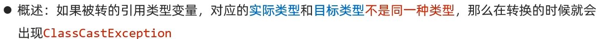

# JavaSE学习

## 静态 static修饰成员的特点


## 运算符

### 扩展赋值运算符

扩展赋值运算符，内部自带强转效果


### 关系运算符


不用记，若想让哪个先运算，只需加小括号

## 成员变量和局部变量的区别


## this关键字


## 标准Javabean


## String类的特点


### String类截取方法


## StringBuilder的特点

### 构造方法和介绍


### 提高了字符串的效率


### 常用的成员方法


### StringBuilder和StringBuffer区别

成员方法一致

但是StringBuilder多线程不安全但效率偏高

StringBuffer多线程安全但效率偏低

## ArrayList集合


### ArrayList集合成员方法


## extends继承


注意事项：


### 只支持单继承，不支持多继承，支持多层继承

例子：


不能多继承原因：如果多继承  会导致子类若执行俩父类中声明完全相同方法时，不知道会执行哪一个

## 权限修饰符


***其中protected***不常用访问麻烦  需要在子类中通过创建新方法然后通过super方法进行调用

## This和super

### 开闭原则：


例如

1.0版本有三个成员变量

1.1版本有四个成员变量

则在不修改原来代码的基础上，对原有构造方法进行重载，加上新成员变量

代码如下

```java
public A(){

this.(a,b,c)

this.d = d

}
```

### this和super


##  final关键字


### 细节补充：


## abstract抽象类和抽象方法


### 什么时候用：

把子类共性的方法抽取到父类，发现描述不清时，就可以把此方法变为抽象方法来让子类重写

### 定义格式


### abstract关键字冲突

final：被final修饰的方法无法进行重写

private：抽象方法需子类重写。private修饰后不能跨类调用无法重写

static：类名可调用static修饰的方法，对于抽象方法无意义

### abstract抽象类注意事项

1.不能实例化（不能创建对象）

防止调用内部方法

2.存在构造方法

通过子类super调用抽象父类构造方法

3.存在普通方法体

可以通过子类进行访问

4.抽象类的子类	

要么重写所有抽象方法，要么本身就是抽象类

## 接口介绍：

接口：体现的思想是对规则的声明

**成员变量：默认被public static final所修饰，所以只能为常量**

**成员方法：默认被public abstract所修饰，只能为抽象方法*****但是JDK7 和8有一些新特性***

接口无构造方法

​           Java中更多的体现是对行为的抽象


### 定义方法：

```java
interface inter{
    public abstract void a();
    public abstract void b();
}

class interfac implements inter{

​    @Override
​    public void a() {

​    }

​    @Override
​    public void b() {

​    }
}
```

没啥用  做个测试 哈哈哈哈哈 图床使用


## 多态：

### 前提：

1. 有继承/实现关系
2. 有方法重写
3. **父类引用指向子类对象**

​           

### 成员访问特点：

成员变量：编译看左边（父类）运行看左边（父类）

成员方法：编译看左边（父类）运行看右边（子类）

-  在编译时会检查父类中有无这个方法。无就报错，有则编译通过，但执行子类方法

- 原因：防止父类方法为抽象方法

- 多态创建对象，调用静态成员

  静态成员仅推荐用类名调用，即使通过对象名调用也是假象，生成字节码文件后会自动改为类名调用

### 好处和弊端：

拓展性！拓展性！我理解为复用性也有  代码量减少了一点


#### 多态转型：转型问题




解决方法：

instanceof类型

格式：`对象名 instanceof 类型`

判断一个对象是否是右边的引用类型

返回boolean类型的结果

## JDK8和9版本的新特性：

### JDK8中：

允许在接口定义非抽象方法，但是需要关键字default修饰，这些方法时默认方法

作用：解决接口升级问题

接口中默认方法定义格式

格式：`public default 返回值类型 方法名(参数列表){}`

重新interface接口里的默认方法时，要将标识interface接口名加在前

例如 `inter.super.method()`

#### 2:接口中允许定义static静态方法

接口中静态方法的定义格式：

格式：public static 返回值类型 方法名(参数列表){}

注意事项：


### JDK9中：


#### 为和允许定义私有方法：


提升复用性，减少冗余代码

## 代码块

**了解即可**


## 内部类：

### 成员内部类：了解

**了解即可**

翻看Java源代码会有内部类，所以得了解，无知识盲区


#### 内部类成员访问：

内部类中，访问外部类成员：直接访问，私有也可以

外部类中，访问内部类成员：需要创建对象访问，


#### 为何要学习内部类？

**封装性更好**

例如：


### 静态内部类：了解

static修饰的成员内部类

创建对象格式：外部类名.内部类名 对象名 = new 外部类名.内部类对象();

注意事项：静态只能访问静态 （原因：静态随着类的加载而加载）

### 局部内部类：了解


鸡肋语法，不作赘述

### 匿名内部类：必须掌握！！

一个特殊的局部内部类

前提：存在一个接口或类

格式：`new 类名 接口名(){}`

好处：使代码更简洁，定义一个类的同时对其实例化。

**什么时候用？**接口内部需要抽象方法很少时，使用匿名内部类较好


## Lambda表达式

JDK8版本后开始的一种新语法形式。

作用：简化匿名内部类的代码写法

格式：

```java
(重写方法的形参) -> {被重写方法的方法体代码}
```

注意Lambda表达式只适用于简化函数式接口的匿名内部类的写法形式

####  函数式接口：内部抽象方法只有一个

***若对于代码理解到位，则可以通过写完匿名内部类后，光标放到匿名内部类名字上alt+回车改变为Lambda形式***

### Lambda表达式的省略形式：


### 一个例子演示Lambda写法 匿名内部类写法和实现类写法：

```java
public class Test1 {
    public static void main(String[] args) {
//        Lambda写法
        useinter( i -> System.out.println("这里是Lambda表达式写法")); //完整写法  useinter( （int i) -> {System.out.println("这里是Lambda表达式写法");});
        System.out.println("------------------------------");
//        使用多态并在外部写实现类的方法
        useinter(new im());
        System.out.println("------------------------------");
//        匿名内部类写法
        useinter(new im(){
            @Override
            public void show(int i) {
                System.out.println("这里是匿名内部类写法");
            }
        });
    }
    public static void useinter(inter i){
        i.show(10);
    }
}
interface inter{
    void show(int i);
}
class im implements inter{

    @Override
    public void show(int i) {
        System.out.println("这里是实现类写法");
    }
}

```

### Lambda表达式和匿名内部类区别：


## 窗体，组件，事件：

```java
package com.icecat.frame;
/*
    .*意思补充，意为加载前者类下所有的包
 */
import javax.swing.*;

public class FrameTest1 {
    public static void main(String[] args) {
//        创建窗体对象
        JFrame frame = new JFrame();
//        设置窗体尺寸
        frame.setSize(1920,1080);
//        设置窗体关闭模式，可以直接写数字1，2，3.WindowConstants.EXIT_ON_CLOSE=3，意思是关闭窗口同时关闭java虚拟机。如果不写默认为隐藏窗口
        frame.setDefaultCloseOperation(WindowConstants.EXIT_ON_CLOSE);
//        设置标题
        frame.setTitle("猫瑾醒了吗丶到窗体一游");
//        设置窗体可见  注意：一定要最后设置窗体可见，要让在此之前的图片按钮的功能加载好后最后展示窗体
        frame.setVisible(true);
    }
}
```

效果展示：


### 窗体添加按钮：

```java
package com.icecat.frame;

import javax.swing.*;
/*
JButton构造方法：
         public JButton():创建一个空白按钮
         public JButton(String text):创建一个带文本的按钮
 */
public class JbuttonTest1 {
    public static void main(String[] args) {
        JFrame frame = new JFrame();
//        设置按钮前需要先取消按钮默认布局
        frame.setLayout(null);
//        创建按钮对象
        JButton btn = new JButton("不要点我");
//        设置按钮位置以及大小
        btn.setBounds(175,225,100,100);
//        将按钮添加到窗体的（面板对象）中
        frame.getContentPane().add(btn);
        frame.setSize(400,500);
        frame.setDefaultCloseOperation(3);
        frame.setVisible(true);
    }
}
```

### 窗体添加图片，文字：

```java
package com.icecat.frame;

import javax.swing.*;

public class JlableTest1 {
    public static void main(String[] args) {
        JFrame frame = new JFrame();
        frame.setSize(1200,1000);
        frame.setDefaultCloseOperation(3);
        frame.setLayout(null);
//        Jlable展示文本和图片  先创建Jlabel对象
//        1.展示文本
        JLabel jl1 = new JLabel("薇尔莉特");
        jl1.setBounds(100,50,60,60);
        frame.getContentPane().add(jl1);
        JLabel jl2 = new JLabel("小鸟游六花");
        jl2.setBounds(160,50,80,60);
        frame.getContentPane().add(jl2);
//        2，展示图像
        JLabel jl1_1jpg = new JLabel(new ImageIcon("D:\\Develop\\Advanced-codes\\day09-codes\\src\\com\\icecat\\可愛い.jpg"));
        jl1_1jpg.setBounds(100,110,690,690);
        frame.getContentPane().add(jl1_1jpg);
//          展示窗体
        frame.setVisible(true);
    }
}
```


### 事件监听：

分为两个

#### ActionListener:动作监听


#### KeyListener：键盘监听


#### 注意事项

1：**其中键盘监听中：**

如何确定键盘录入按键（ASCII码）

并且第一个keyTyped方法不常用，因为有些方法监听不到

2：**监听冲突问题**

焦点：程序的注意力集中在了某一组件上

注意：按钮组件比较特殊，创建好后就自动聚焦，但是并不需要，还可能会和键盘监听起冲突问题

可以通过：`setFocusable(false)`来取消焦点


### 适配器设计模式


### 模板设计模式


**优势：已经定义了通用结构，使用者只需关心自己需要实现的功能即可**

