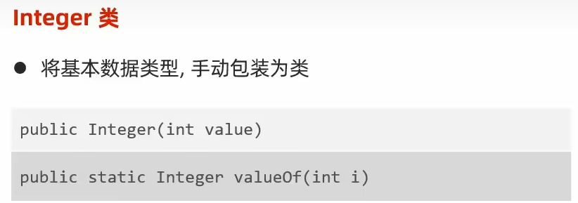

# 常用API

## Object类

### toString方法

`public String toString()`默认是返回当前对象再堆内存中的地址信息：类的全类名@十六进制哈希值

#### 用途：

在开发过程中直接输出对象看到对象地址是毫无意义的，更多时候是希望看到对象中的内容数据而不是假地址信息

所以toString()方法存在的意义就是为了被子类重写，以便返回对象的内容信息，而不是地址信息。

### equals方法

`public boolean equals(Object 0)`默认是比较当前对象与另一对象地址值是否相同，返回boolean类型

#### 意义：

父类equals方法存在的意义就是为了子类重写，以便于子类自己定制比较规则

**IDEA中重写的equals方法：**

```java
public boolean equals(Object o) {
        if (this == o) return true;
        if (o == null || getClass() != o.getClass()) return false;
        Student student = (Student) o;
        return age == student.age && Objects.equals(name, student.name);
    }
```

### **Objects类中的equals方法**

避免了空指针异常问题

```java
public static boolean equals(Object a, Object b) {
    return (a == b) || (a != null && a.equals(b));
}
```

双&&或者双||，都是执行左边若为false或者true则右侧不执行


## Math类：工具类

方法都为静态方法，通过类名.的形式调用


## System类


注意：返回时间为现在时间减去1970年1月1日0时的毫秒值，为何？1970年1月1日是c语言的生日

## BigDecimal类

### 创建对象传入数据：


仅推荐用后两个，解决小数运算不精确的问题

### 常用成员方法


## 包装类

用处：将基本数据类型包装成类，变成引用数据类型

**只做Integer类的讲述，其余可以类比Integer来进行**



注意：从JDK5版本开始，出现了自动拆装箱技术

自动装箱：基本数据类型的变量可以直接赋值给包装类型（引用数据类型）的变量;

自动拆箱：包装类型（引用数据类型）的变量转化为基本数据类型的变量；

总结：基本数据类型和对应的包装类，可以直接运算，不用转换了

### 常用方法：


### 面试题


## Arrays类

数组工具类，方法都为静态方法


1. 其中binarySearch()方法，给予的数组必须是排好序的。因为使用了二分法
2. sort()方法中，对数组进行了默认升序排序，要进行其他顺序排序，需学习**红黑树**


## 基本算法：

### 1:冒泡排序

```java
/**
 * 冒泡排序 相邻两数据作比较，前者大于后者则做交换，往后进行
 */
public class Bubbling {
    public static void main(String[] args) {
        int[] arr = {3,2,1,6,4,7,10,1};
        //外循环控制比较的轮数
        for (int i = 0; i < arr.length - 1; i++) {
            //比较的次数
            //-1是避免索引越界
            //-i 是对内存做优化 不用每次都比较到最后减少循环次数
            for (int j = 0; j < arr.length - 1 - i; j++) {
                if(arr[j] > arr[j+1]){
                    int temp;
                    temp = arr[j];
                    arr[j] = arr[j+1];
                    arr[j+1] = temp;
                }
            }
        }
        System.out.println(Arrays.toString(arr));
    }
}
```

### 2:选择排序

让数组中第一个数据依次和后面的数据作比较，和数据小的做交换，然后再第二个，第三个，最后完成从小到大的排序

```Java
public class SelectSort {
    //选择排序，让数组中第一个数据依次和后面的数据作比较，和数据小的做交换，然后再第二个，第三个，最后完成从小到大的排序
    public static void main(String[] args) {
        int[] arr = {22,11,33,33,44,55,14};
        for (int i = 0; i < arr.length - 1; i++) {
            //外循环，控制第几个数据和后面数据做比较
            for (int j = i+1; j < arr.length; j++) {
                //内循环：控制第一个数据和后数据依次比较
                if (arr[i] > arr[j]){
                    int temp = arr[i];
                    arr[i] = arr[j];
                    arr[j] = temp;
                }
            }
        }
        System.out.println(Arrays.toString(arr));
    }
}
```

### 3:二分查找


**使用场景：查找有序数组中对应元素的索引可以用二分查找。**

定义三个元素，最大索引，最小索引，中间索引，将中间索引指向元素和目标数据比较，中间索引元素大则右边以及中间索引元素本身则不用在比较，将最大索引缩小为 mid -1,与之相反，若小于目标元素，则本身以及左边元素不用在比较，将最小索引为mid +1,一直循环直到mid = 目标元素索引，或min > max;返回对应mid即可

```Java
public class BinarySearch {
    public static void main(String[] args) {
        int[] arr = {11,22,33,44,55,66,77};
        int num = binSearch(arr,22);
        System.out.println(num);
    }

    private static int binSearch(int[] arr, int i) {
        int max = arr.length-1;
        int min = 0;
        int mid;
        while (min <= max){
            mid =(max + min) / 2;
            if (arr[mid] < i){
                min = mid +1;
            }else if(arr[mid] > i){
                max = mid -1;
            } else {
                return mid;
            }
        }
        return -1;
    }
}

```

