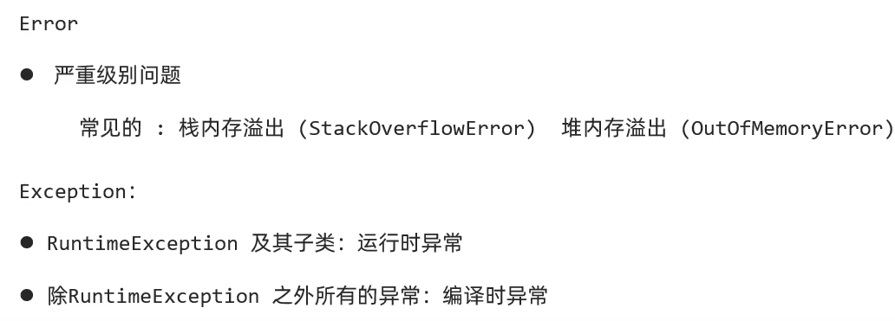

# 异常

分为Error 和 Exception

其中Exception中 又分为两类，如图中所示

其中两种错误的表现形式有下列

# 异常的两种处理方式

1. **try...catch...捕获异常**

   

2. **throws抛出异常**

   

## 两种方式怎么选择：

思路：这个问题是否需要暴漏出来？
需要暴漏，用throws

不需要暴漏，用try catch

## throws和throw的区别

# 自定义异常

# 异常中的细节

