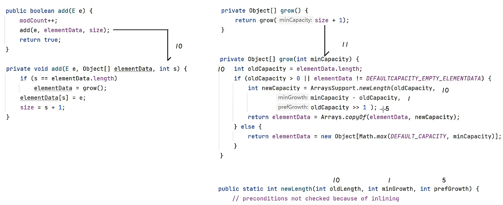

# 集合：

**总结：**


其中Collection接口中又分为**set**接口和**list**接口

## Collection:


**注意事项：**

remove and contains方法依赖于底层equals方法

## 集合通用遍历方法：

### 1.迭代器  2.增强for循环  3.forEach

首先获取迭代器：

`Iterator<Student> it = c.iterator();`

其次判断循环是否还有元素

`hasNext()方法`    `next()方法`    

注意：next()方法只调用一次，要不然会引起指针异常

### 迭代器源码解析：


### **三种方法演示：**

```java
public class Test2 {
    public static void main(String[] args) {
        Collection<Student> c = new ArrayList<>();
        c.add(new Student("小鸟游六花",15));
        c.add(new Student("小鸟游七花",15));
        c.add(new Student("小鸟游八花",15));

        //迭代器循环
        Iterator<Student> it = c.iterator();

        while (it.hasNext()){
            Student stu = it.next();
            System.out.println(stu.getName()+"---"+stu.getAge());
        }

        //增强for循环
        for (Student stu:c){
            System.out.println(stu);
        }

        //forEach遍历
        c.forEach(student -> System.out.println(student));
    }
}
```

# List集合

## list集合特点以及方法


## 并发修改异常：


## List集合的5种遍历方式

1. Iterator迭代器
2. 增强for循环
3. foreach
4. 普通for循环
5. ListIterator迭代器

# 数据结构：栈 队列 链表 数组


## 其中Arraylist集合扩容机制为

1. 在初始化时长度为0
2. 调用添加方法add时长度为10
3. 此后长度超过10时，会将数组长度增加原来的1/2

#### **源码分析**：**此为长度还未超出10时的源码过程**


####          **此为超出10时源码过程**：



## LinkedList特有方法

removeFirst()   removeLast()
